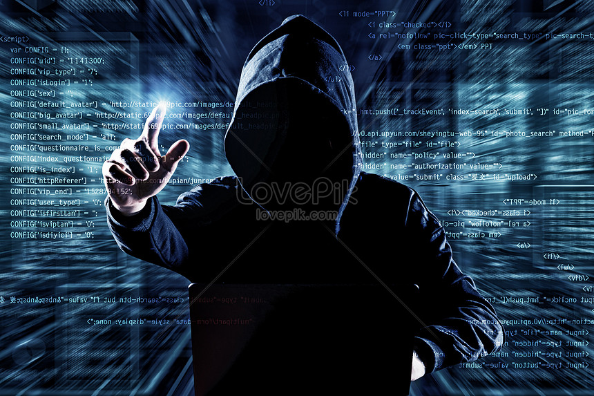

# Image Steganography-GUI

**Image steganography** hides secret information inside digital images so the embedded data is invisible to the human eye while preserving the picture’s appearance. This project leverages pixel redundancy to encode a password-protected message with Least Significant Bit (LSB) editing, plus text-to-speech playback for decoded messages.

**Types of Image Steganography**

**1. Least Significant Bit (LSB) Method**
Modifies the least significant bit of pixel values to store message bits. Because LSB changes barely affect color, the image looks unchanged to humans.

**2. RGB-Based Steganography**
Encodes data across the Red, Green, and Blue channels (often an LSB variant per channel or more advanced schemes).

**Type Used in This Project**

This application uses the Least Significant Bit (LSB) method with a simple password check (password:secret~ format) to gate access during decoding.

**Features**

1. Encode & decode text messages inside images (PNG/JPG/BMP/TIFF)
2. Password gate on decoding
3. Medium-size image preview in a clean Tkinter GUI
4. Text-to-Speech (TTS) to speak the decoded secret
5. User chooses where to save the encoded image
   
**Libraries Used :** tkinter, opencv-python, numpy, pillow, pyttsx3

      pip install tkinter opencv-python numpy pillow pyttsx3
      
**How It Works (LSB Overview)**

1. Combine password and secret as password:secret~ (tilde marks end).

2. Convert the string to a bitstream.

3. Flatten the image’s RGB array and replace each pixel’s least significant bit with each message bit.

4. Save the modified image.

5. For decoding, read LSBs back into bytes until ~, split at :, and verify the password.

**Usage (GUI)**

1. Input Image → choose a source picture.

2. Enter Password and Secret Message.

3. Click Encode → pick a filename to save the encoded image.

4. Load an image and click Decode to reveal the message (enter the same password).

5. Click Speak to hear the decoded message via TTS.

**Output Images**

The original image will remain visually unchanged, while the encoded image will have the hidden data embedded in its pixel values. The differences are imperceptible to the human eye but can be decoded using the provided decryption method. The output images are as follows:
## Comparison of Original and Encoded Images

| hacker.jpg | encrypted.png |
|:--------:|:-------:|
|  |  |
| Original | Encoded |

**Here is the Execution:**

**Encoding:**

**Decoding:**

**Audio :**

**Audio Feature**
This project includes an audio file `Decoded.wav` used for testing the audio playback feature.
You can play it in the GUI by clicking the **Play Audio** button.

